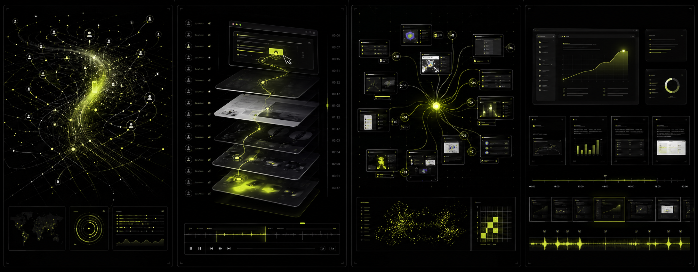
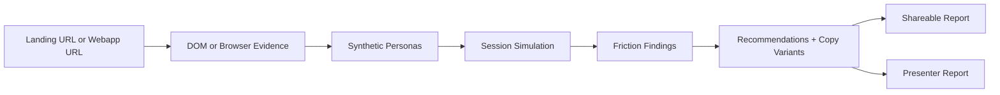

# FrictionLab

FrictionLab is an AI conversion research lab for landing pages and early webapp flows. It takes a real URL, extracts page or browser-session evidence, runs synthetic buyer personas through the experience, and turns the results into evidence-backed findings, copy recommendations, a shareable report, and a Presenter Report.

The goal is simple: replace subjective landing-page feedback with a repeatable research workflow teams can inspect, share, and ship against.



## What It Does

- Audits a public landing page URL with server-side extraction.
- Audits permitted webapp signup/onboarding flows with a controlled Browserless/Playwright agent.
- Extracts title, meta description, headings, CTAs, links, visible text, and page sections.
- For webapp audits, persists browser steps, DOM observations, optional screenshots, and Gmail confirmation events.
- Generates synthetic personas and session timelines with structured AI output.
- Uses a fast model for persona/session/navigation steps and a strong model for final synthesis, recommendations, reports and presenter scenes.
- Produces prioritized friction findings tied to evidence references or explicit `missing_information`.
- Creates recommendations, copy variants, a shareable report, and a Presenter Report storyboard.
- Persists the entire audit workflow in Postgres with inspectable tool and agent events.
- Captures optional desktop/mobile screenshots with Browserless and stores them in Vercel Blob when both credentials are configured.
- Supports demo/offline operation through `MOCK_MODE=true`.

## Why It Exists

Most AI landing-page feedback is a single generic opinion. FrictionLab is built as a research pipeline:



Every output should be traceable back to page evidence, persona behavior, or a clearly marked information gap.

## Review Philosophy

FrictionLab is calibrated to be useful, not performative. The audit should be evidence-backed, direct and constructive: it should call out real conversion risk without turning the report into a roast, and it should not soften clear blockers into vague encouragement.

Findings distinguish observed friction from inferred risk, include severity, preserve positive signals when they matter, and end in concrete next actions a product or growth team can ship.

## Tech Stack

- Next.js App Router
- TypeScript
- Prisma + Postgres
- Vercel AI SDK
- Vercel AI Gateway, OpenAI and Anthropic provider support
- Tailwind CSS
- GSAP for landing-page motion
- Vitest
- Vercel deployment target

## Architecture

```text
app/
  api/audits                  Create an audit run
  api/audits/[id]             Fetch persisted audit state
  api/audits/[id]/events      Poll workflow/tool events
  api/reports/[shareId]       Public report data
  api/health/readiness        Runtime dependency check
  audit/*                     Audit UI, report and presenter views
  r/[shareId]                 Public share page

lib/
  extraction/                 Server-side page fetch and DOM parsing
  ai/                         Provider routing and structured generation
  workflow/                   Sequential persisted audit runner
  runtime/                    Deploy/runtime readiness checks
  schemas/                    Shared Zod contracts
  webapp/                     Browser, mailbox, guardrail and navigation-agent services
```

`POST /api/audits` creates a persisted `AuditRun` in `RUNNING` state, responds quickly, and schedules the workflow after the response. The dashboard polls until the run reaches `COMPLETED`, `PARTIAL`, `FAILED`, or `DEMO`.

## Local Setup

```bash
npm install
cp .env.example .env
npm run prisma:generate
npm run prisma:migrate
npm run dev
```

Open:

```text
http://localhost:3000
```

## Environment Variables

Required for persisted audits:

```bash
DATABASE_URL=""
```

Recommended for your current Anthropic-only setup:

```bash
ANTHROPIC_API_KEY=""
FRICTIONLAB_FAST_MODEL="anthropic:claude-sonnet-4-5"
FRICTIONLAB_STRONG_MODEL="anthropic:claude-sonnet-4-5"
```

Model usage:

- `FRICTIONLAB_FAST_MODEL`: persona generation, session simulation and webapp navigation-agent decisions.
- `FRICTIONLAB_STRONG_MODEL`: aggregation, recommendations, copy variants, shareable reports and Presenter Report scenes.

Optional GPT-5.5 routing through Vercel AI Gateway:

```bash
AI_GATEWAY_API_KEY=""
FRICTIONLAB_FAST_MODEL="openai/gpt-5.4-mini"
FRICTIONLAB_STRONG_MODEL="openai/gpt-5.5"
```

Vercel documents GPT-5.5 with the `openai/gpt-5.5` Gateway model id in its [AI Gateway changelog](https://vercel.com/changelog/gpt-5.5-on-ai-gateway). Direct provider model ids use `provider:model`; Gateway model ids use `provider/model`; the explicit `gateway:provider/model` prefix is also supported. On Vercel, OIDC-based Gateway auth can satisfy the same readiness check without committing a token.

Runtime behavior:

```bash
MOCK_MODE="false"
DEMO_FALLBACK="true"
NEXT_PUBLIC_APP_URL="http://localhost:3000"
```

Abuse controls:

```bash
AUDIT_RATE_LIMIT_MAX="5"
AUDIT_RATE_LIMIT_WINDOW_SECONDS="600"
RATE_LIMIT_DISABLED="false"
```

Optional integrations:

```bash
BROWSERLESS_TOKEN=""
BROWSERLESS_WS_URL=""
BROWSERLESS_SESSION_TTL_MS="900000"
BLOB_READ_WRITE_TOKEN=""
ENABLE_SCREENSHOT_CAPTURE="false"
ENABLE_REMOTION_RENDER="false"
```

Webapp agent audits:

```bash
WEBAPP_BROWSER_PROVIDER="browserless"
WEBAPP_MAX_STEPS="20"
AGENT_MAILBOX_HOST="imap.gmail.com"
AGENT_MAILBOX_PORT="993"
AGENT_MAILBOX_SECURE="true"
AGENT_MAILBOX_USER=""
AGENT_MAILBOX_APP_PASSWORD=""
```

`BROWSERLESS_TOKEN` uses Browserless Session API by default and stores the returned session id on `BrowserRun`. `BROWSERLESS_WS_URL` remains an explicit connection override. `AGENT_MAILBOX_USER` should be a dedicated Gmail inbox used only for test accounts; Gmail app passwords require 2-Step Verification. FrictionLab uses plus-addressing for each run and stores only redacted confirmation metadata, not mailbox secrets, raw confirmation links, or codes.

## Runtime Readiness

Check whether the deployed app can run real audits:

```bash
curl http://localhost:3000/api/health/readiness
```

Readiness states:

- `ready`: database is configured and the selected mode can run.
- `degraded`: database exists, but the configured model credentials are missing, so audits fall back to template artifacts.
- `blocked`: required runtime dependency is missing, usually `DATABASE_URL`.

## API Surface

```http
POST /api/audits
GET  /api/audits/:id
GET  /api/audits/:id/events
GET  /api/reports/:shareId
POST /api/presenter/:auditRunId
POST /api/presenter/:auditRunId/render
GET  /api/health/readiness
```

Create audit input:

```json
{
  "url": "https://vercel.com",
  "targetAudience": "technical founders evaluating developer platforms",
  "conversionGoal": "Start a trial",
  "businessType": "devtool",
  "language": "en",
  "market": "US",
  "brandTone": "precise, technical and premium",
  "personaCount": 4,
  "demoMode": false
}
```

Create webapp audit input:

```json
{
  "auditType": "WEBAPP",
  "url": "https://app.example.com/signup",
  "targetAudience": "B2B SaaS operators evaluating workflow software",
  "conversionGoal": "Create an account and complete onboarding",
  "businessType": "saas",
  "language": "en",
  "personaCount": 4,
  "demoMode": false,
  "scenarioPrompt": "Sign up, confirm the account, complete onboarding and identify friction.",
  "signupAllowed": true,
  "allowedDomains": ["app.example.com", "example.com"],
  "maxSteps": 12,
  "mailboxMode": "GMAIL_IMAP"
}
```

## Scripts

```bash
npm test
npm run typecheck
npm run build
npm run verify
npm run prisma:migrate
npm run prisma:migrate:deploy
```

## Deployment

The app is built for Vercel.

```bash
npm test
npm run typecheck
npm run build
npx vercel deploy --prod
```

After setting `DATABASE_URL` in Vercel, run production migrations:

```bash
npm run prisma:migrate:deploy
```

More details are in [docs/deployment.md](docs/deployment.md).
Webapp audit setup and smoke testing are in [docs/webapp-agent-audits.md](docs/webapp-agent-audits.md).

## Public Safety

This repository intentionally ignores:

- `.env` and `.env.*`
- `.vercel/`
- `node_modules/`
- `.next/`
- generated local archives and machine metadata

Do not commit provider keys, database URLs, Vercel tokens, or local deployment metadata.

Before switching the repository to public, verify that only examples are tracked and run a redacted secret scanner such as Gitleaks or GitHub secret scanning:

```bash
git ls-files | grep -E '(^|/)\.env($|\.|example)' || true
```

The package keeps `"private": true` in `package.json` to prevent accidental npm publishing; that does not prevent the GitHub repository from being public.

## Current Scope

P0 is a real vertical slice: DOM evidence extraction, structured AI or explicit fallback, persisted workflow state, report UI, public share links, Presenter Report data, and controlled webapp signup/onboarding audits.

Landing audit screenshots are disabled by default. Set `ENABLE_SCREENSHOT_CAPTURE=true` only when `BROWSERLESS_TOKEN` and a public-compatible `BLOB_READ_WRITE_TOKEN` are configured; otherwise audits use DOM evidence and do not create screenshot fallback events.

P1 candidates:

- Vercel Workflow / WDK durable execution
- Browserbase or E2B if Browserless is not enough for longer webapp sessions
- Optional video rendering from Presenter Report scenes
